# PROJET : création d’un logiciel de gestion
d’établissement scolaire

## Foncionnalités :

Application web  permettant :

* De se connecter avec l'identifiant et le mot de passe `directeur`
* Créer un étudiant
## Diagrammes :
* Diagramme Use case
 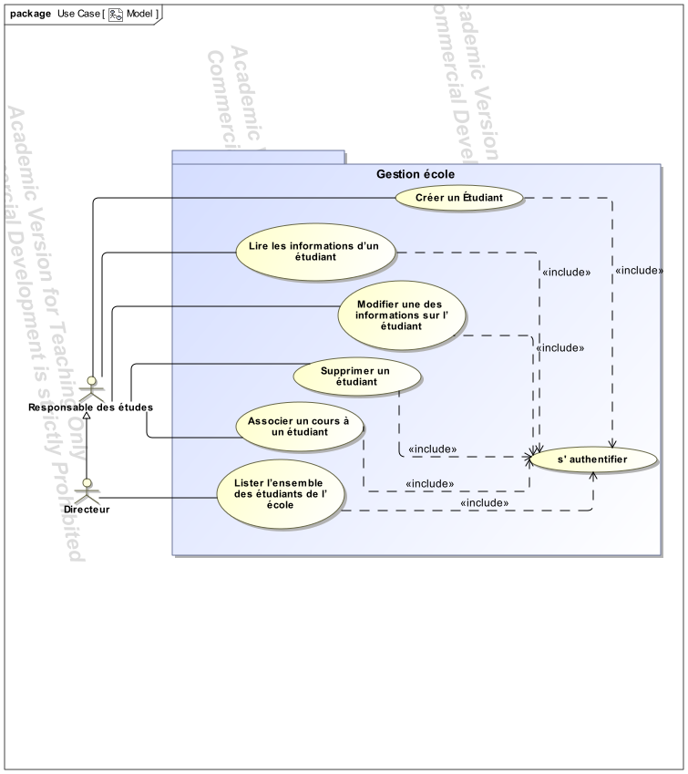
* Diagramme Classe
  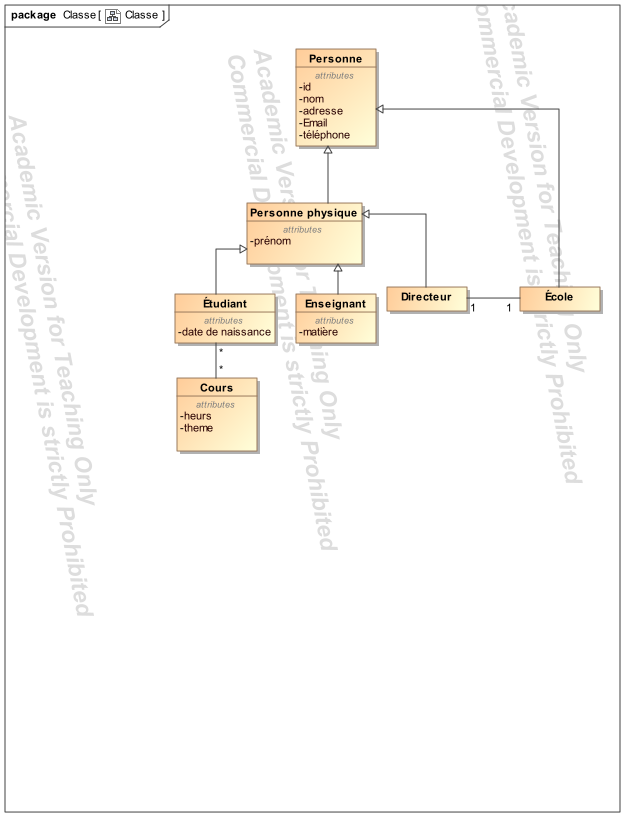
* Diagrammes Activités
    - Associer un cours à un étudiant
 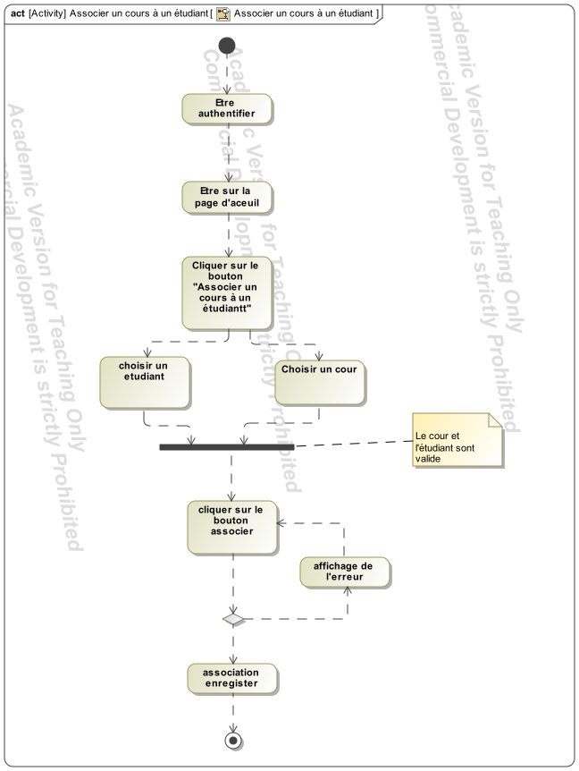
    - Creation_d'un_étudiant
 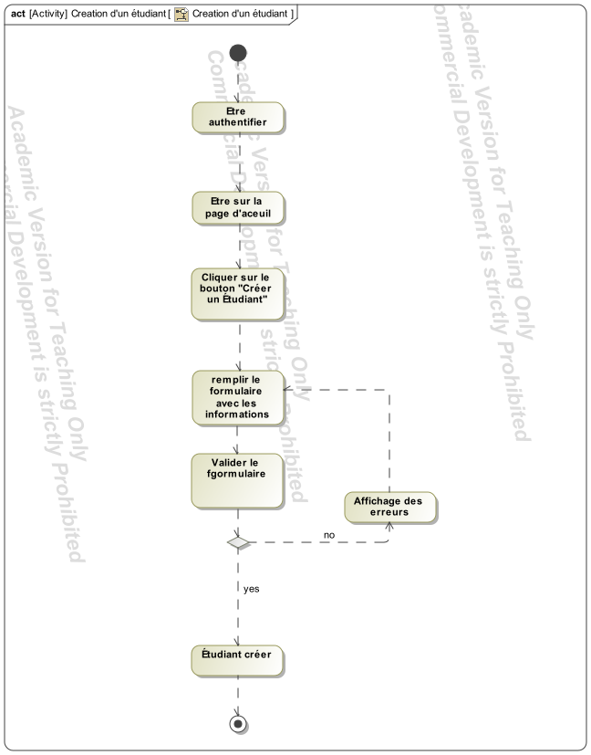
    - Lire_les_information_d'un_étudiant
 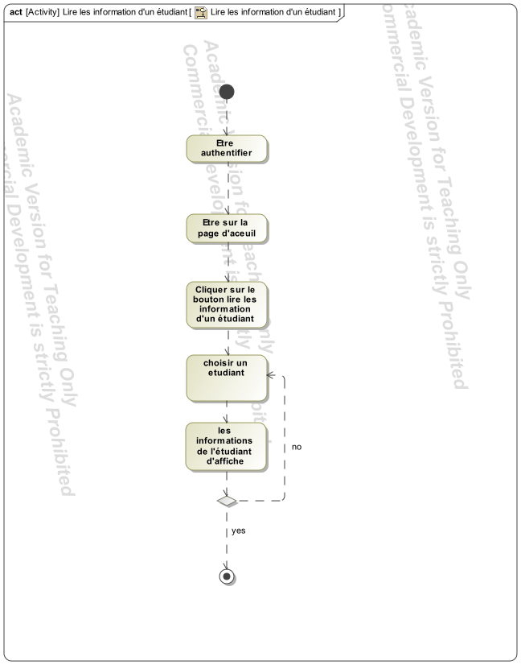
    - Lister_l'emsemble_des_étudiants
 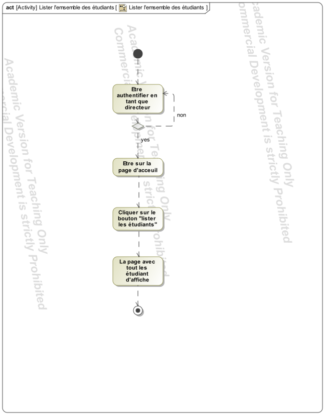
    - Modifier_un_étudiant
 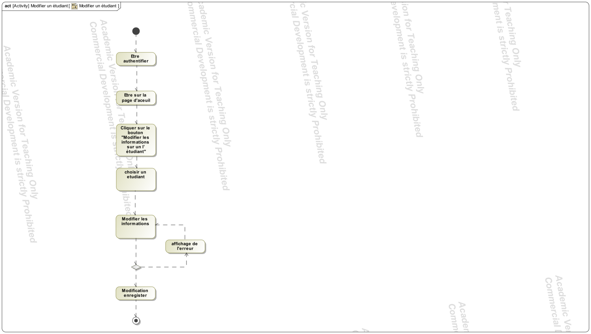
    - S'authentifier
 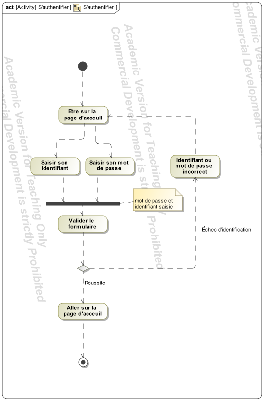
    - Supprimer_un_étudian
 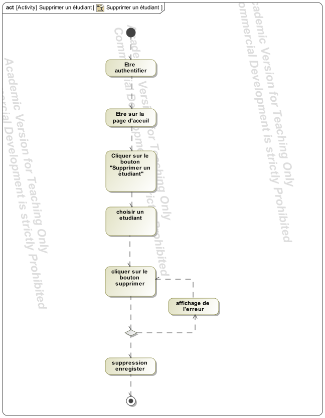

* Diagrammes Séquences
    - Associer un cours à un étudiant
      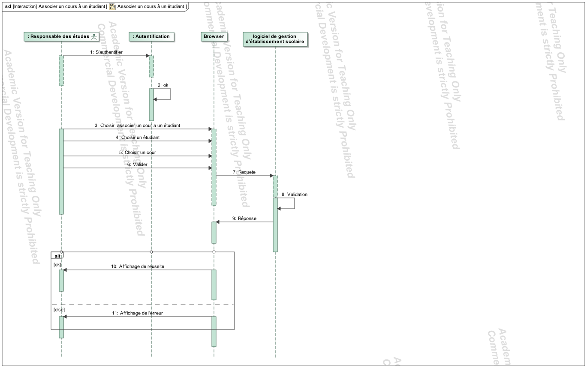
    - Creation_d'un_étudiant
      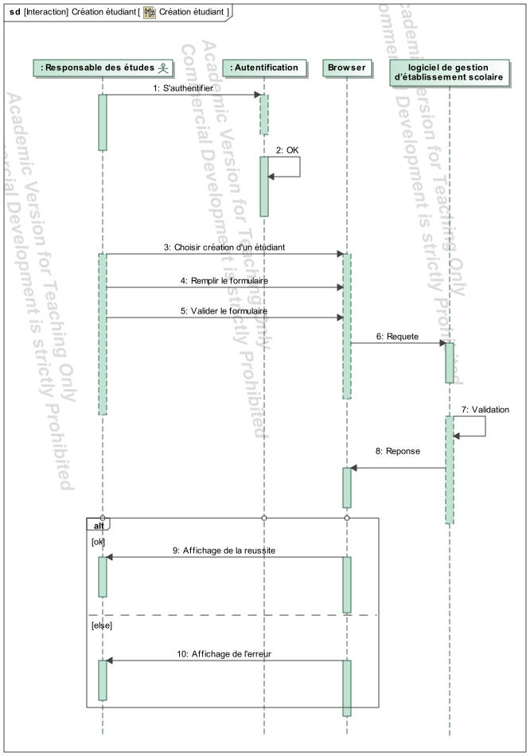
    - Lire_les_information_d'un_étudiant
      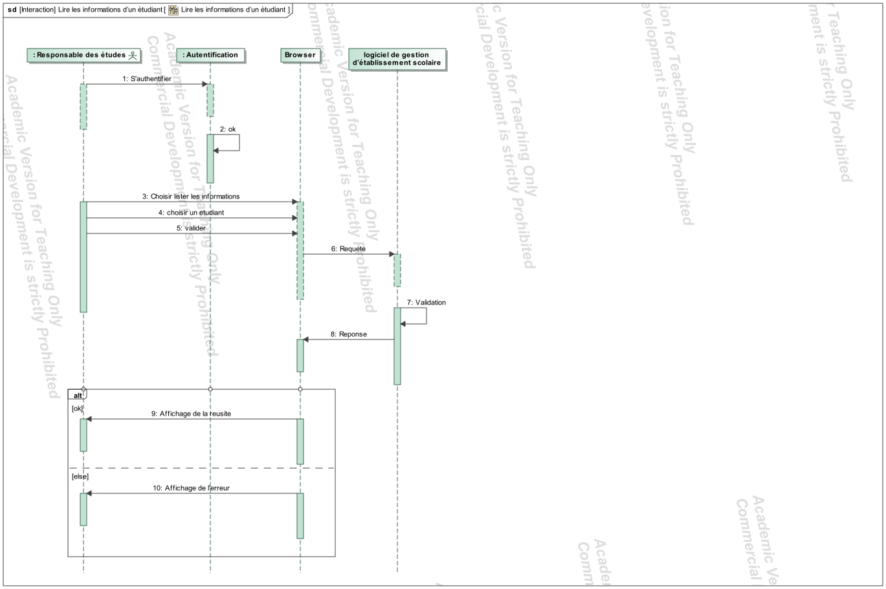
    - Lister_l'emsemble_des_étudiants
      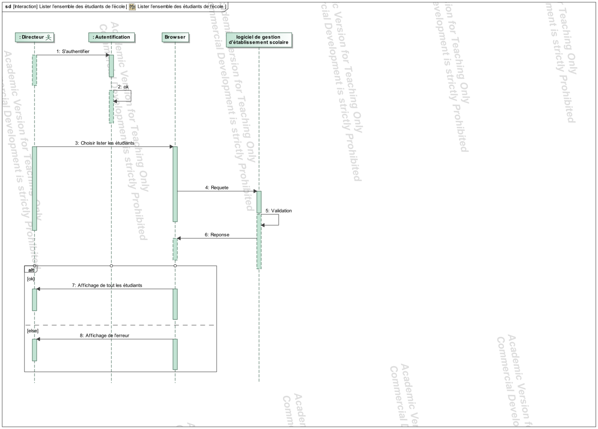
    - Modifier_un_étudiant
      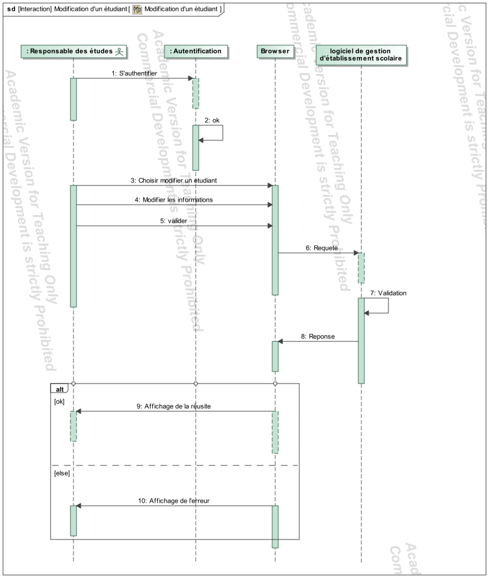
    - S'authentifier
      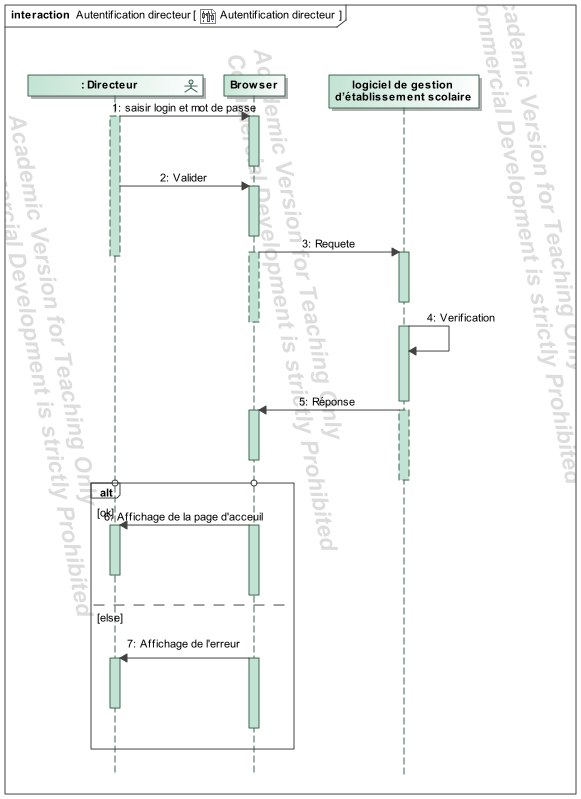
      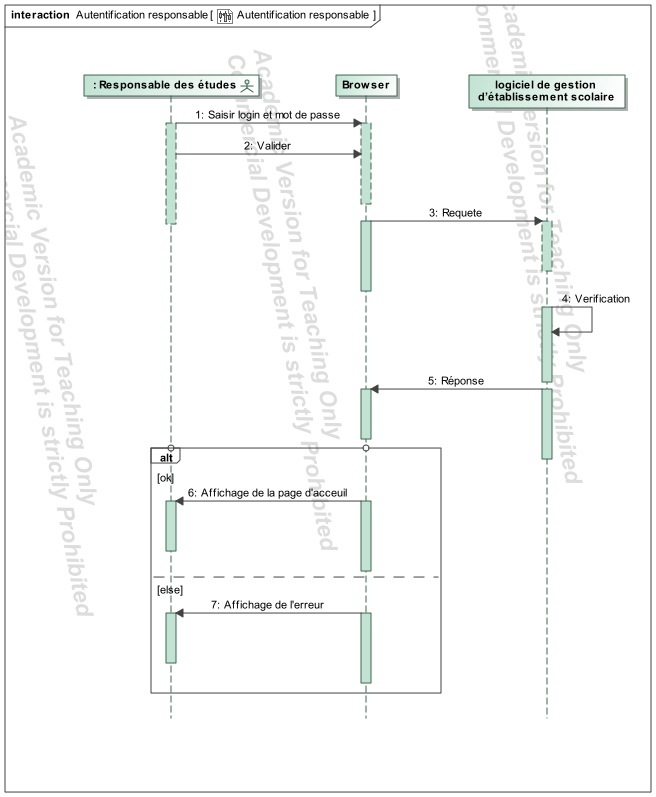
    - Supprimer_un_étudian
      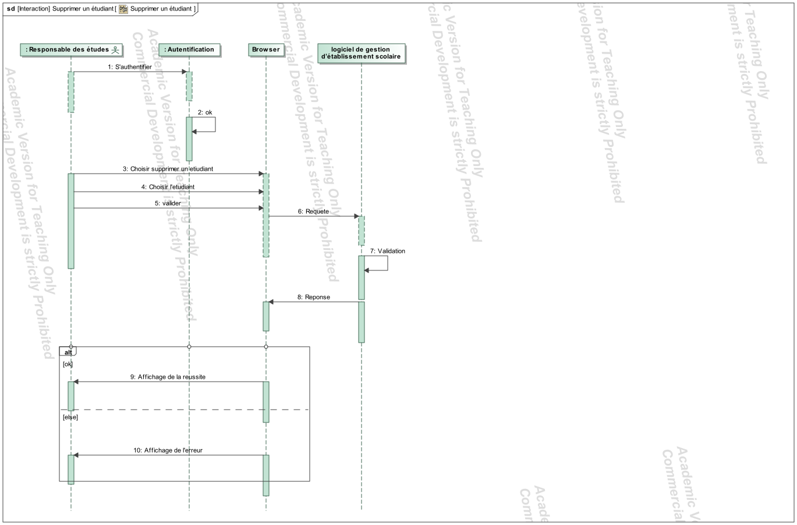

          
## Prérequis :
* Java : version `11.0.0`
* Maven : version `3.6.3`
* Système de gestion de Base de donnée: `MySQL`

## Framework :
### Spring :
Spring est un framework JAVA qui permet de développer des applications web, dans le cadre de ce projet nous avons utilisé plusieurs foncionnalités de Spring :

* l'injection de dépendences
* Configuration automatique en déclarant les propriétés dans le fichier `application.properties`
* l'implémentation du pattern MVC
* l'utilisation du moteur de template [Thymleaf](https://www.thymeleaf.org/) pour la partie front-end

## Utilisation :
* Créer un répertoire à l'emplacement de votre choix,
* Créer un une base de données `course`
* Lancer la commande `git clone https://github.com/Flav1-ann/course`
* Accéder au repértoire course
* Executer la commande `/mvn spring-boot:run`
* Rendez-vous sur http://localhost:8080/couse

## Logs :
Vous pouvez retrouver les logs dans les différents sous-dossiers de MyResto dans un dossier nommer `logging.file.*`
Les logs sont ranger dans des dossiers en fonction du jour ou ils ont été générer.

## DEVOPS :

### Pour lancer l'application via docker en local

- docker
- docker-compose

### Pour lancer avec terraform et ansible sur AWS
* Rendez vous sur `https://github.com/Flav1-ann/course_deploy`

- Terraform
- ansible
- Un compte AWS ayant la possibilité de créer des instances ec2 AWS
- Avoir les connaissances de base sur AWS
- Avoir des connaissances en système et réseaux

## Lancer l'application avec docker & docker-compose 
- Récupérer le repository.
- ouvrer un terminal ou une invite de commande à la racine du repository
- effectuer la commande `docker-compose up -d`
- attendez la fin de la commande

Maintenant vous pouvez accéder à l'application à l'adresse [localhost](http://localhost:8080/course/login)

### La clé d'accès et la clé secret

La clé d'accès et la clé secret sont des clé fournis par AWS

Accéder à votre dashboard AWS de votre compte.
Vous trouverez l'access key et la secret key dans --> `Mes informations d'identification de sécurité` --> `informations d'identification AWS IAM`
Vous devriez voir un bouton nommé `Créer une clé d'accès`, cliquez desssus pour créer une clé d'accès.
Afficher la clé secret et sauvegarder là ! Si vous la perdez vous ne pourrez pas la récupérer il vous faudra re créer une autre clé dans ce cas.

Vous avez maintenant l'access key ( la clé d'accès étant l'ID de clé d'accès dans l'interface AWS ) et la secret key.

### La clé SSH public/privé

Pour la clé ssh il faudra la généré vous même.
Pour linux, ssh-keygen est déjà installé par défaut. Il vous suffit de faire la commande : `ssh-keygen -t rsa -b 2048` et de répondre au choix qui seront affiché.

Vous pouvez laisser le chemin par défaut ou de spécifier un chemin specifique, à vous de voir.
Pour la phrase vous pouvez laisser vide et valider.

Vous avez maintenant une clé ssh public et privé ! (vous les trouverez sous linux par défaut dans `~/.ssh/id_rsa` ou dans le chemin que vous avez précisé).

### Executer Terraform

- Récupérer le repository.
- ouvrer dans un terminal ou une invite de commande le dossier `terraform` du repository
- exécuter la commande `terraform init`
- exécuter la commande `terraform apply`. La commande va vous demandez de fournir dans l'ordre : l'access key, la clé ssh **PUBLIQUE**, et la clé secret
- Attendez que la commande est terminé

Si tous c'est bien passé vous devriez voir à la fin le message : `vm_public_id = xx.xx.xx.xx` copier cette adresse ! (pas de panique si vous avez déjà clear votre terminal vous pouvez voir l'adresse ip v4 de votre instance sur le dashboard AWS)

### Configurer ansible

- ouvrez le fichier `ansible/inventory.yml` dans un éditeur de texte.
- modifier la ligne `0.0.0.0` par l'adresse ip public de votre vm récupèré précédement
- modifier la ligne `ansible_ssh_private_key_file` par le chemin de votre clé ssh privé

### Exécuter ansible

- ouvrer dans un terminal ou une invite de commande le dossier `ansible` du repository
- exécuter la commande `ansible-playbook -i inventory.yml playbook.yml`
- Attendez la fin de la commande

### Accéder aux site

Pour accéder au site et vérifier que tout à bien fonctionner accéder via l'adresse ip public de votre vm (celle utiliser dans le fichier inventory.yml)

**ATTENTION** L'https n'est pas mis en place il faudra donc y accéder via http://L'ipPublicDeVotreVM

## Tester notre application 

Nous avons déjà déployé notre application sur AWS vous pouvez y accéder [ici](http://3.220.51.2:8080/course/login)
